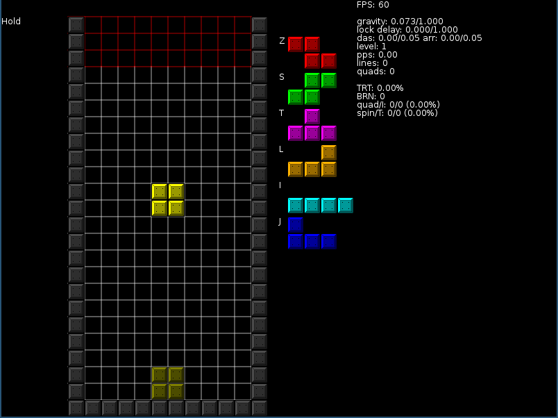

ChAoS_Dragon's Falling Block Trainer (CDFBT) is a falling block game.

### Features

* All spins work, Z-spins, J-spins, T-spins, you name it.
* Use the mouse to draw blocks. Useful for practicing setups and such.
* Horizontal line in next queue marks bag boundaries.
* Add new pieces by adding a file to the pieces directory.
* Invisible mode.

### Adding new pieces

Each shape is a table:

    shape = "A", the id of the shape, doesn't need to be one letter, but does need to be unique.
    rotation_coords = {...}, the position of the individual blocks, for each rotation.
    kick_table = {...}, where the piece should try to move when kicking.
    spin_coords = {...}, when a piece locks, if these positions are filled, it counts as a spin.

after the table, the line:

    shapes["A"] = A
    
adds the shape to the shapes table along with it's id.

### Misc

Placing a piece completely within the red area at the top of the playfield
counts as topping out.

By default, the game only has one level; level_speed_table in options.lua lets
you add more. it's a table of tables that contain two values each:

    {1, 0}, rows per second and lock delay in seconds
    
For example, if you want five levels:

    level_speed_table = {
        {1, 1},
        {0.9, 0.9},
        {0.8, 0.8},
        {0.7, 0.7},
        {0.6, 0.6}
    }

Sound was made with [jfxr](https://jfxr.frozenfractal.com/#).
